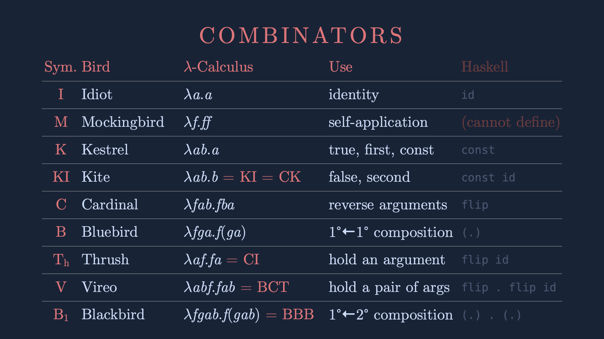

== Notizen Video Gabriel Lebec

TBO continued.

Lamda is a signifyer of a function

This function takes a single input and returns an expression -> basically a unary (single input) anonymous function.

Lamda calculus syntax:

* is a symbol manipulation framework
* goal: evaluation & defining function

expression  ::= variable (identifyer)
| expression expression (application)
| Lamda variable.expression (abstraction)
| (expression)  (grouping, disambiguate the order of the functions)

|===
|what|lamda |JS | comment

|variable|a|a|in Lamda Calc. variables are immutable, once bound to a value, they stay that forever (final).
|application|f a|f(a))|function, which takes an a as argument
|application 2|f a b|f(a)(b)|curried function, function which takes an a returns a function (not written) which takes a b. we could make this explicit with parentheses((f a) b), but since parameters are fed in from left to right, not needed.
|application 3|f (a b)|f (a(b))|here the order is different, we first apply a to b and then f to the result of a(b)
|abstraction|lamda a.b x |a => b(x)| greedy, swallows as much from the right as it can.
|abstraction 2| lamda (a.b) x|(a => b) x|take a function, that goes from a to b and apply it to argument x.
|abstraction 3| lamda a.lamda b.a or lamda a.(lamda b.a)| a => b => a| paretheses not necessary
|abstraction 4|lamda a.lamda b.lamda c.b can also be written as lamda abc.b |a => b => c => b|It is NOT a ternary function, all inputs are fed in one by one
|Beta-reduction|((lamda a.a)lamda b.lamda c.b)(x)lamda e.f||tracing the logic, seeing what we end up with.
|Mocking Bird (M)|M := lamda f.ff| M = f => f(f)|selfapplication of a function. selfapplication of identity is identity M(I) = I, but M(M) will be an endlos loop, because no beta normalform. Sometimes Mockingbirds is litte omega.
|Kestrel (K)|lamda ab.a|a => b => a| With a Kestrel it does not matter, what the second input is, it always returns the first one. e.g. K => I => M = M, K => M => I = M.
In Haskel this is the `const` function, because it is fixated to the first function.
|Kite combinator (KI)|lamda ab.b| a => b => b|Kite takes two arguments (curried style), but always gives back the second one.
Kite can be expressed with Kestrel and I: Kite = KI.
It can also be expressed by a Cardinal of a Kestrel: Kite = CK
|Cardinal combinator|lamda fab.fba|C = f => a => b => f(b)(a) | flips the arguments (Vertauschung). In Haskell it is built in the language `flip`

|===

|===
|Moses Elias Schönfinkel | Haskell B Curry |Raymond Smullyan

Identitätsfunktion|I|Idiot or Ibis
Konstante Funktion|K|Kestrel
|verSchmelzungsfunktion S|S|Starling
|verTauschungsfunktion T|C|Cardinal
|Zusammensetzungsfunktion Z|B|Bluebird
|===

What is a combinator?

a function with no free variables.
A free variable is a variable which is not bound in the body.

* lamda b.b is a combinator
* lamda b.a is not a combinator (where does the a come from?)
* lamda ab.a is a combinator (we are not using the b, which is a parameter)
* lamda a.ab is not a combinator (where does the b come fr
* lamda abc.c(lamda e.b) is a combinator (c & b are bound, a & e are parameters)

*lamda calculus and turing machines are equivalent, therefore everything can be functions.*
Computers are built like stateful turing machines, even higher level languages like c.
Why do we ever bother with memory -> we just use functions, which are based on lamda calc.

Examples:

* boolean: !x == y || (a && z) how to express in lamdacalc? +
JS const result = bool ? exp1 : exp2 +
LamdaCalc:
----
result := bool exp1 exp2
result := func exp1 exp2 // when func true exp1, esle exp2
thus:
true := K
false := KI

JS:
const T = K
const F = KI
const not = p => p(F)(T) // that works because if p is K it selects the first one and if p is KI, it selects the second one.
----

We have another combinator which does that -> Cardinal

But Cardinal generates a new function which behaves the same

Extensional equality: the functions are the same, if for every input they generate the same output

Intensional equality: The internal of a function is equal.
